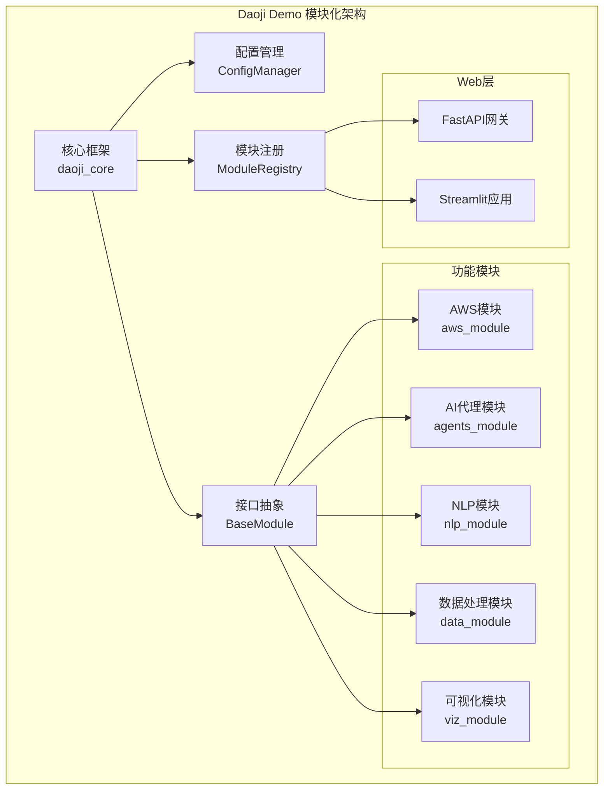

# 🎨🎨🎨 创意阶段: 整体架构设计 🎨🎨🎨

## 问题陈述

**挑战**: Daoji Demo项目当前包含多个独立的实验模块，缺乏统一的架构设计，导致：
- 模块间缺乏标准化接口
- 配置管理分散且不一致
- 代码重复和依赖关系混乱
- 难以维护和扩展

**目标**: 设计一个模块化、可扩展、易维护的整体架构，统一管理多个技术栈。

## 系统需求分析

### 核心需求
- **模块化**: 各功能模块独立开发和部署
- **可扩展性**: 支持新模块的轻松添加
- **统一配置**: 集中化的配置管理
- **标准接口**: 模块间通信的标准化
- **错误处理**: 统一的错误处理和日志记录

### 技术约束
- 必须支持现有的Python 3.12+环境
- 兼容FastAPI、Streamlit、LangChain等现有技术栈
- 保持向后兼容性
- 使用uv作为包管理器

## 组件分析

### 核心组件识别
1. **配置管理器** - 统一管理所有模块配置
2. **模块注册器** - 动态发现和注册模块
3. **接口抽象层** - 定义标准的模块接口
4. **错误处理器** - 统一的异常处理和日志
5. **数据流管理器** - 模块间数据传递
6. **Web服务网关** - 统一的API入口

### 现有模块映射
- `daoji_demo.traffic` → AWS服务模块
- `agents/` → AI代理模块
- `small_model/` → NLP处理模块
- `json_decode/` → 数据处理模块
- `word_cloud/` → 可视化模块

## 架构选项分析

### 选项1: 微服务架构
**描述**: 将每个功能模块作为独立的微服务，通过API网关统一管理

**优点**:
- 高度解耦，独立部署
- 技术栈灵活性高
- 水平扩展能力强
- 故障隔离性好

**缺点**:
- 复杂度高，运维成本大
- 网络通信开销
- 数据一致性挑战
- 对于实验性项目过于复杂

**技术适配度**: 中等
**复杂度**: 高
**可扩展性**: 高

### 选项2: 模块化单体架构
**描述**: 在单一应用中实现模块化设计，通过依赖注入和接口抽象实现解耦

**优点**:
- 开发和调试简单
- 部署简单，运维成本低
- 模块间通信高效
- 适合实验性项目

**缺点**:
- 模块间可能存在隐式耦合
- 单点故障风险
- 扩展时需要整体重新部署
- 技术栈相对固定

**技术适配度**: 高
**复杂度**: 中等
**可扩展性**: 中等

### 选项3: 插件化架构
**描述**: 基于插件系统的架构，核心框架提供基础服务，功能模块作为插件动态加载

**优点**:
- 高度灵活，支持动态加载
- 核心稳定，插件可独立开发
- 易于扩展新功能
- 配置驱动的模块管理

**缺点**:
- 插件接口设计复杂
- 版本兼容性管理困难
- 调试和测试复杂度增加
- 性能可能受到影响

**技术适配度**: 中等
**复杂度**: 中等
**可扩展性**: 高

## 🎨 创意检查点: 架构选项评估

基于项目特点（实验性、多技术栈、快速迭代），**选项2: 模块化单体架构** 最适合当前需求。

## 决策与理由

**选择**: 模块化单体架构

**理由**:
1. **适合项目规模**: 对于实验性项目，简单性比复杂的分布式架构更重要
2. **开发效率**: 单一代码库便于快速迭代和实验
3. **技术栈兼容**: 能够很好地整合现有的Python技术栈
4. **维护成本**: 运维简单，适合个人或小团队维护
5. **扩展性**: 通过良好的模块化设计，仍能支持未来的扩展需求

## 实施计划

### 架构设计图

### 实施步骤
1. **创建核心框架** (`daoji_core/`)
   - 定义BaseModule抽象类
   - 实现ConfigManager
   - 实现ModuleRegistry
   
2. **重构现有模块**
   - 将现有功能包装为标准模块
   - 实现统一的配置接口
   - 添加标准的错误处理

3. **创建Web网关**
   - FastAPI统一API入口
   - Streamlit应用集成

4. **测试和优化**
   - 单元测试
   - 集成测试
   - 性能优化

## 验证

### 需求满足度检查
- ✅ 模块化: 通过BaseModule接口实现
- ✅ 可扩展性: 通过ModuleRegistry支持动态注册
- ✅ 统一配置: 通过ConfigManager实现
- ✅ 标准接口: 通过BaseModule抽象类定义
- ✅ 错误处理: 在核心框架中统一实现

### 技术可行性
- ✅ Python 3.12+兼容
- ✅ 现有技术栈集成
- ✅ uv包管理器支持
- ✅ 向后兼容性保证

### 风险评估
- **低风险**: 架构相对简单，技术成熟
- **中等风险**: 模块重构可能需要较多时间
- **缓解策略**: 分阶段实施，保持现有功能可用

🎨🎨🎨 **退出创意阶段 - 架构决策完成** 🎨🎨🎨 