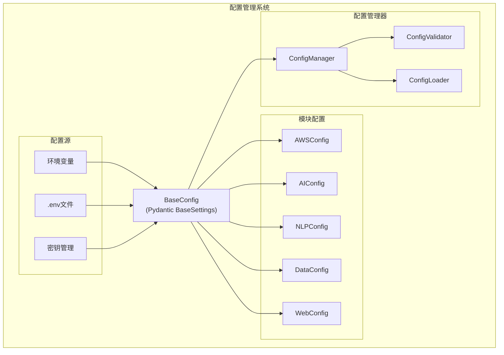

# 🎨🎨🎨 创意阶段: 配置管理系统设计 🎨🎨🎨

## 问题陈述

**挑战**: 当前项目的配置管理分散且不一致：
- AWS模块需要环境变量配置
- 不同模块有不同的配置格式
- 缺少配置验证和默认值管理
- 开发、测试、生产环境配置混乱
- 敏感信息（API密钥）缺乏安全管理

**目标**: 设计一个统一、安全、灵活的配置管理系统，支持多环境、类型安全、热重载等特性。

## 配置需求分析

### 配置类型识别
1. **环境配置**: 数据库连接、API端点等
2. **功能配置**: 模块开关、参数调优等
3. **敏感配置**: API密钥、密码等
4. **运行时配置**: 日志级别、调试模式等

### 现有配置分析
- `daoji_demo/traffic.py`: 使用python-dotenv读取.env文件
- 各模块: 硬编码配置或临时环境变量
- 缺少: 配置验证、类型检查、默认值

### 需求规格
- **统一接口**: 所有模块使用相同的配置API
- **类型安全**: 配置值的类型验证和转换
- **环境隔离**: 开发/测试/生产环境配置分离
- **安全性**: 敏感信息加密存储
- **验证**: 配置完整性和有效性检查
- **热重载**: 运行时配置更新（可选）

## 配置管理选项分析

### 选项1: 基于Pydantic的配置类
**描述**: 使用Pydantic BaseSettings创建类型安全的配置类

**优点**:
- 强类型检查和自动转换
- 内置验证功能
- 良好的IDE支持和文档
- 与FastAPI生态系统集成良好
- 支持多种配置源（环境变量、文件等）

**缺点**:
- 学习曲线相对较高
- 配置结构相对固定
- 大型配置可能导致类定义复杂

**技术适配度**: 高
**复杂度**: 中等
**安全性**: 高

### 选项2: 分层配置文件系统
**描述**: 使用YAML/TOML配置文件 + 环境变量覆盖的分层系统

**优点**:
- 配置结构清晰，易于管理
- 支持复杂的嵌套配置
- 环境特定配置覆盖
- 配置文件可版本控制

**缺点**:
- 需要额外的配置解析逻辑
- 类型安全需要额外实现
- 配置验证需要自定义

**技术适配度**: 中等
**复杂度**: 中等
**安全性**: 中等

### 选项3: 配置中心模式
**描述**: 实现一个配置中心，支持动态配置和远程管理

**优点**:
- 集中化配置管理
- 支持动态更新
- 配置版本控制和回滚
- 多应用配置共享

**缺点**:
- 系统复杂度大幅增加
- 需要额外的基础设施
- 对于单体应用过于复杂
- 增加了系统依赖

**技术适配度**: 低
**复杂度**: 高
**安全性**: 高

## 🎨 创意检查点: 配置方案评估

基于项目特点（模块化单体、实验性、快速迭代），**选项1: 基于Pydantic的配置类** 最适合。

## 决策与理由

**选择**: 基于Pydantic的配置类系统

**理由**:
1. **类型安全**: Pydantic提供强类型检查，减少配置错误
2. **生态集成**: 与FastAPI、现有Python生态系统完美集成
3. **开发效率**: 自动验证和转换，减少样板代码
4. **文档化**: 配置结构自文档化，便于维护
5. **适度复杂**: 复杂度适中，不会过度工程化

## 实施计划

### 配置系统架构



### 配置类设计示例

```python
# daoji_core/config/base.py
from pydantic import BaseSettings, Field
from typing import Optional
from enum import Enum

class Environment(str, Enum):
    DEVELOPMENT = "development"
    TESTING = "testing"
    PRODUCTION = "production"

class BaseConfig(BaseSettings):
    """基础配置类"""
    environment: Environment = Environment.DEVELOPMENT
    debug: bool = Field(default=False, description="调试模式")
    log_level: str = Field(default="INFO", description="日志级别")
    
    class Config:
        env_file = ".env"
        env_file_encoding = "utf-8"
        case_sensitive = False

# daoji_core/config/aws.py
class AWSConfig(BaseConfig):
    """AWS服务配置"""
    aws_access_key_id: Optional[str] = Field(None, description="AWS访问密钥")
    aws_secret_access_key: Optional[str] = Field(None, description="AWS秘密密钥")
    aws_region: str = Field(default="us-east-1", description="AWS区域")
    
    class Config:
        env_prefix = "AWS_"

# daoji_core/config/ai.py
class AIConfig(BaseConfig):
    """AI服务配置"""
    openai_api_key: Optional[str] = Field(None, description="OpenAI API密钥")
    openai_base_url: str = Field(default="https://api.openai.com/v1", description="OpenAI API基础URL")
    model_cache_dir: str = Field(default="./models", description="模型缓存目录")
    
    class Config:
        env_prefix = "AI_"
```

### 配置管理器实现

```python
# daoji_core/config/manager.py
from typing import Dict, Type, TypeVar
from .base import BaseConfig

T = TypeVar('T', bound=BaseConfig)

class ConfigManager:
    """配置管理器"""
    _configs: Dict[str, BaseConfig] = {}
    
    @classmethod
    def register_config(cls, name: str, config_class: Type[T]) -> T:
        """注册配置类"""
        config = config_class()
        cls._configs[name] = config
        return config
    
    @classmethod
    def get_config(cls, name: str) -> BaseConfig:
        """获取配置"""
        if name not in cls._configs:
            raise ValueError(f"配置 {name} 未注册")
        return cls._configs[name]
    
    @classmethod
    def validate_all(cls) -> bool:
        """验证所有配置"""
        for name, config in cls._configs.items():
            try:
                config.dict()  # 触发验证
            except Exception as e:
                print(f"配置 {name} 验证失败: {e}")
                return False
        return True
```

### 实施步骤

1. **创建配置基础设施**
   - 实现BaseConfig基类
   - 创建ConfigManager
   - 添加配置验证器

2. **定义模块配置**
   - AWSConfig for AWS服务
   - AIConfig for AI代理
   - NLPConfig for NLP处理
   - WebConfig for Web服务

3. **集成现有模块**
   - 重构traffic.py使用新配置系统
   - 更新其他模块的配置读取
   - 创建环境特定的配置文件

4. **安全性增强**
   - 敏感信息环境变量化
   - 配置验证和默认值
   - 开发/生产环境隔离

### 配置文件结构

```
config/
├── .env.example          # 配置模板
├── .env.development      # 开发环境配置
├── .env.testing         # 测试环境配置
└── .env.production      # 生产环境配置（不提交到版本控制）
```

## 验证

### 需求满足度检查
- ✅ 统一接口: 通过BaseConfig和ConfigManager实现
- ✅ 类型安全: Pydantic提供强类型检查
- ✅ 环境隔离: 通过不同的.env文件实现
- ✅ 安全性: 敏感信息通过环境变量管理
- ✅ 验证: Pydantic内置验证功能

### 技术可行性
- ✅ Pydantic已在项目依赖中
- ✅ 与现有FastAPI集成良好
- ✅ 向后兼容现有配置方式
- ✅ 支持渐进式迁移

### 风险评估
- **低风险**: Pydantic是成熟的库，社区支持良好
- **中等风险**: 需要重构现有配置读取代码
- **缓解策略**: 保持现有配置方式兼容，逐步迁移

🎨🎨🎨 **退出创意阶段 - 配置管理决策完成** 🎨🎨🎨 