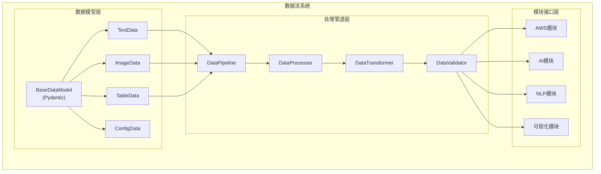

# 🎨🎨🎨 创意阶段: 数据流设计 🎨🎨🎨

## 问题陈述

**挑战**: 当前项目的模块间数据传递缺乏标准化：
- 各模块独立处理数据，缺乏统一的数据格式
- 模块间数据传递通过临时文件或直接调用
- 缺少数据验证和转换机制
- 没有统一的错误处理和数据流监控
- 数据处理管道不够灵活

**目标**: 设计一个标准化、类型安全、可扩展的数据流系统，支持模块间高效的数据传递和处理。

## 数据流需求分析

### 数据类型识别
1. **结构化数据**: JSON、CSV、数据库记录
2. **非结构化数据**: 文本、图片、文档
3. **流式数据**: 实时数据流、事件流
4. **配置数据**: 模块参数、运行时配置

### 现有数据流分析
- `traffic.py`: AWS API响应 → 表格显示
- `entities_extract.py`: 文本输入 → NER结果
- `word_cloud/`: 文本文件 → 词云图片
- `json_decode/`: JSON字符串 → 解析结果

### 数据流需求
- **类型安全**: 数据结构的类型检查和验证
- **转换管道**: 数据格式转换和处理链
- **错误处理**: 数据处理异常的统一处理
- **监控**: 数据流的追踪和性能监控
- **缓存**: 中间结果的缓存机制
- **异步处理**: 支持异步数据处理

## 数据流设计选项分析

### 选项1: 基于Pydantic的数据模型系统
**描述**: 使用Pydantic定义标准数据模型，模块间通过类型化的数据对象通信

**优点**:
- 强类型检查和自动验证
- 序列化/反序列化自动化
- 与FastAPI生态系统集成良好
- 自文档化的数据结构
- IDE支持和代码补全

**缺点**:
- 对于简单数据传递可能过于复杂
- 数据模型变更需要版本管理
- 大型数据对象的性能开销

**技术适配度**: 高
**复杂度**: 中等
**性能**: 中等

### 选项2: 事件驱动的消息系统
**描述**: 实现事件总线，模块通过发布/订阅模式进行数据交换

**优点**:
- 高度解耦的模块通信
- 支持异步处理
- 易于扩展和监控
- 支持多对多的数据流

**缺点**:
- 系统复杂度较高
- 调试和追踪困难
- 对于简单项目过于复杂
- 需要额外的消息队列基础设施

**技术适配度**: 中等
**复杂度**: 高
**性能**: 高

### 选项3: 管道式数据处理
**描述**: 实现数据处理管道，支持链式数据转换和处理

**优点**:
- 清晰的数据流向
- 易于理解和调试
- 支持中间结果缓存
- 处理步骤可复用

**缺点**:
- 相对线性的处理流程
- 复杂数据流的表达能力有限
- 错误处理需要特殊设计

**技术适配度**: 高
**复杂度**: 中等
**性能**: 中等

## 🎨 创意检查点: 数据流方案评估

基于项目特点（模块化单体、实验性、多种数据类型），**选项1: 基于Pydantic的数据模型系统** 结合 **选项3: 管道式数据处理** 的混合方案最适合。

## 决策与理由

**选择**: Pydantic数据模型 + 管道式处理的混合方案

**理由**:
1. **类型安全**: Pydantic确保数据结构的正确性
2. **处理灵活**: 管道式处理支持复杂的数据转换
3. **生态集成**: 与现有FastAPI和配置系统集成良好
4. **渐进式**: 可以逐步迁移现有数据处理逻辑
5. **适度复杂**: 复杂度适中，不会过度工程化

## 实施计划

### 数据流系统架构



### 数据模型设计

```python
# daoji_core/data/models.py
from pydantic import BaseModel, Field
from typing import Any, Dict, List, Optional, Union
from datetime import datetime
from enum import Enum

class DataType(str, Enum):
    TEXT = "text"
    IMAGE = "image"
    TABLE = "table"
    JSON = "json"
    BINARY = "binary"

class BaseDataModel(BaseModel):
    """基础数据模型"""
    id: str = Field(description="数据唯一标识")
    type: DataType = Field(description="数据类型")
    timestamp: datetime = Field(default_factory=datetime.now, description="创建时间")
    metadata: Dict[str, Any] = Field(default_factory=dict, description="元数据")
    
    class Config:
        json_encoders = {
            datetime: lambda v: v.isoformat()
        }

class TextData(BaseDataModel):
    """文本数据模型"""
    type: DataType = DataType.TEXT
    content: str = Field(description="文本内容")
    language: Optional[str] = Field(None, description="语言")
    encoding: str = Field(default="utf-8", description="编码")

class TableData(BaseDataModel):
    """表格数据模型"""
    type: DataType = DataType.TABLE
    headers: List[str] = Field(description="表头")
    rows: List[List[Any]] = Field(description="数据行")
    schema: Optional[Dict[str, str]] = Field(None, description="数据类型定义")

class ProcessingResult(BaseModel):
    """处理结果模型"""
    success: bool = Field(description="处理是否成功")
    data: Optional[BaseDataModel] = Field(None, description="处理后的数据")
    error: Optional[str] = Field(None, description="错误信息")
    processing_time: float = Field(description="处理时间(秒)")
```

### 数据处理管道

```python
# daoji_core/data/pipeline.py
from typing import Callable, List, Any
from abc import ABC, abstractmethod
import time
import logging

class DataProcessor(ABC):
    """数据处理器抽象基类"""
    
    @abstractmethod
    def process(self, data: BaseDataModel) -> ProcessingResult:
        """处理数据"""
        pass
    
    @abstractmethod
    def can_process(self, data: BaseDataModel) -> bool:
        """检查是否可以处理该数据"""
        pass

class DataPipeline:
    """数据处理管道"""
    
    def __init__(self):
        self.processors: List[DataProcessor] = []
        self.logger = logging.getLogger(__name__)
    
    def add_processor(self, processor: DataProcessor):
        """添加处理器"""
        self.processors.append(processor)
    
    def process(self, data: BaseDataModel) -> ProcessingResult:
        """执行处理管道"""
        start_time = time.time()
        current_data = data
        
        try:
            for processor in self.processors:
                if processor.can_process(current_data):
                    result = processor.process(current_data)
                    if not result.success:
                        return result
                    current_data = result.data or current_data
            
            processing_time = time.time() - start_time
            return ProcessingResult(
                success=True,
                data=current_data,
                processing_time=processing_time
            )
            
        except Exception as e:
            self.logger.error(f"管道处理失败: {e}")
            return ProcessingResult(
                success=False,
                error=str(e),
                processing_time=time.time() - start_time
            )

# 具体处理器示例
class TextNormalizationProcessor(DataProcessor):
    """文本标准化处理器"""
    
    def can_process(self, data: BaseDataModel) -> bool:
        return isinstance(data, TextData)
    
    def process(self, data: BaseDataModel) -> ProcessingResult:
        if not isinstance(data, TextData):
            return ProcessingResult(success=False, error="数据类型不匹配")
        
        # 文本标准化处理
        normalized_content = data.content.strip().lower()
        
        result_data = TextData(
            id=f"{data.id}_normalized",
            content=normalized_content,
            language=data.language,
            metadata={**data.metadata, "processed": True}
        )
        
        return ProcessingResult(success=True, data=result_data, processing_time=0.001)
```

### 模块集成接口

```python
# daoji_core/data/interface.py
from typing import Protocol, runtime_checkable

@runtime_checkable
class DataModule(Protocol):
    """数据模块接口协议"""
    
    def process_data(self, data: BaseDataModel) -> ProcessingResult:
        """处理数据的标准接口"""
        ...
    
    def get_supported_types(self) -> List[DataType]:
        """获取支持的数据类型"""
        ...

class DataFlowManager:
    """数据流管理器"""
    
    def __init__(self):
        self.modules: Dict[str, DataModule] = {}
        self.pipeline = DataPipeline()
    
    def register_module(self, name: str, module: DataModule):
        """注册数据模块"""
        self.modules[name] = module
    
    def route_data(self, data: BaseDataModel, target_module: str) -> ProcessingResult:
        """路由数据到指定模块"""
        if target_module not in self.modules:
            return ProcessingResult(
                success=False,
                error=f"模块 {target_module} 未注册"
            )
        
        # 先通过管道预处理
        pipeline_result = self.pipeline.process(data)
        if not pipeline_result.success:
            return pipeline_result
        
        # 发送到目标模块
        module = self.modules[target_module]
        return module.process_data(pipeline_result.data)
```

### 实施步骤

1. **创建数据模型基础设施**
   - 实现BaseDataModel和具体数据模型
   - 创建ProcessingResult结果模型
   - 添加数据验证和序列化

2. **实现处理管道**
   - 创建DataProcessor抽象基类
   - 实现DataPipeline管道系统
   - 添加常用的数据处理器

3. **重构现有模块**
   - 将现有数据处理逻辑包装为DataProcessor
   - 实现DataModule接口
   - 集成到DataFlowManager

4. **添加监控和缓存**
   - 数据流追踪和日志
   - 中间结果缓存
   - 性能监控和优化

### 数据流示例

```python
# 使用示例
from daoji_core.data import TextData, DataPipeline, DataFlowManager

# 创建数据
text_data = TextData(
    id="sample_text_001",
    content="  Hello World!  ",
    language="en"
)

# 创建处理管道
pipeline = DataPipeline()
pipeline.add_processor(TextNormalizationProcessor())

# 处理数据
result = pipeline.process(text_data)
print(f"处理结果: {result.data.content}")  # "hello world!"
```

## 验证

### 需求满足度检查
- ✅ 类型安全: Pydantic提供强类型检查
- ✅ 转换管道: DataPipeline支持链式处理
- ✅ 错误处理: ProcessingResult统一错误处理
- ✅ 监控: 内置处理时间和日志记录
- ✅ 缓存: 可在处理器中实现缓存逻辑
- ✅ 异步处理: 可扩展为异步处理器

### 技术可行性
- ✅ Pydantic已在项目依赖中
- ✅ 与现有架构和配置系统集成良好
- ✅ 支持渐进式迁移现有数据处理
- ✅ 扩展性良好，支持新的数据类型和处理器

### 风险评估
- **低风险**: 基于成熟的Pydantic库
- **中等风险**: 需要重构现有数据处理逻辑
- **缓解策略**: 保持现有接口兼容，逐步迁移到新的数据流系统

🎨🎨🎨 **退出创意阶段 - 数据流设计决策完成** 🎨🎨🎨 